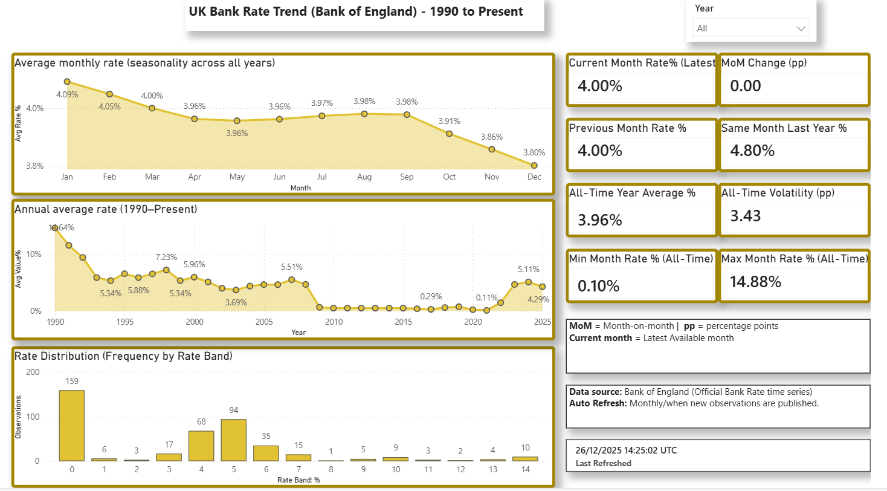
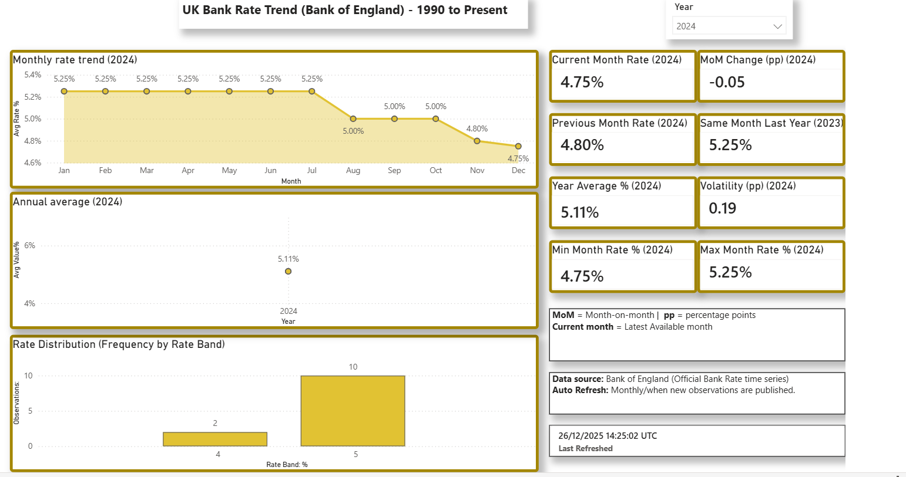

````md
# UK Economic Pulse — Supabase + Power BI + Automated Pipeline

Portfolio project that ingests UK macroeconomic time-series data, loads it into Supabase Postgres, and powers a Power BI dashboard.
Refresh is automated via GitHub Actions (scheduled + manual runs).

## What this shows
- Data ingestion (API/CSV fetch → clean → load)
- SQL modelling (dimensions, facts, reporting views)
- Cloud database (Supabase Postgres)
- BI dashboard (Power BI connected to Postgres views)
- Automation (GitHub Actions scheduled pipeline runs)

## Data source & refresh (at a glance)
**Source:** Bank of England IADB series (e.g., Official Bank Rate monthly average).  
**Refresh:** GitHub Actions runs on a schedule and can be triggered manually.  
**Where “last refreshed” comes from:** `fact_observation.fetched_at` and the view `vw_data_freshness`.

## Database objects used by Power BI
Power BI connects to these:
- `vw_latest_value_per_series`
- `vw_change_vs_prev_period`
- `vw_data_freshness`

## How to run locally
1) Create and activate a virtual environment  
2) Install dependencies
```bash
pip install -r requirements.txt
````

3. Run the pipeline

```bash
python -m ingest.run_pipeline
```

## Environment variables

Create a `.env` file (or set GitHub secrets) with:

* `DATABASE_URL` (see `.env.example`)

> Never commit real credentials.

## Repo structure

* `ingest/` — pipeline runner + SQL runner
* `data/ingest/` — fetch + load logic
* `sql/` — schema, staging, reporting views, checks
* `.github/workflows/` — scheduled automation

## Notes

If the upstream BoE endpoint temporarily blocks requests, the pipeline may ingest 0 new rows but the existing warehouse + dashboard remain usable.

## Dashboard (Power BI)




```

